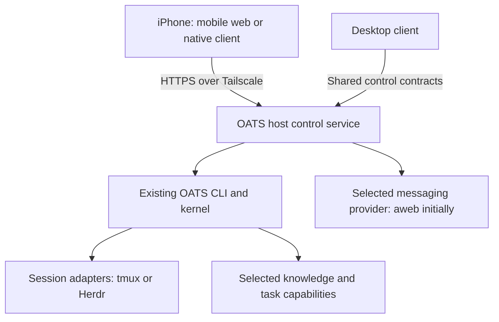

# Proposal: manage server agents from an iPhone

Status: proposed, September 7, 2026. Requested by Juan following a feasibility
assessment. This document authorizes no implementation, deployment, or changes
to running teams. Recommendations below are not shipped functionality.

## Purpose and recommendation

Let an operator manage OATS agents on a server and talk to them from an iPhone.
Agents keep working when the phone is locked, disconnected, or switched off.
Screenshots and files are part of the first useful experience.

Start with one server reached privately through Tailscale and a mobile web app
that can be installed on the iPhone Home Screen. Build on the existing OATS
control and session contracts. A native iPhone app can consume the same service
later if sharing, voice, notifications, or other native integration justify it.

The substantial work is making the client/server boundary explicit and making
conversation delivery reliable. A narrow management and terminal client is
feasible without rewriting the kernel. A polished conversation experience is
more than embedding the Desktop terminal in a small screen.

This extends the [architecture reassessment](2026-09-07-architecture-reassessment.md)
and its interpretation of Juan's KB direction: standard components with clear
contracts, replaceable service providers, and preserved identity and knowledge
across runtime changes. It does not supersede those contracts.

## What exists and what is missing

Assessment baseline: source main `d20f082`, with Desktop behavior inspected in
the lead worktree containing that main. These are reusable pieces, not a claim
that a remote mobile API already exists.

| Area | Existing basis | Work needed for mobile |
| --- | --- | --- |
| Lifecycle and configuration | CLI-backed roster, spawn/start, model choices, retirement and schedule operations | Authenticated network access with exact target selection and truthful results |
| Terminal access | Session adapters, HTTP pane capture/input, Electron PTY attachment | Network streaming, resize, reconnect and bounded viewer lifetime outside Electron |
| Attachments | Desktop file/image ingestion and execution-host upload | Browser or native file selection, authenticated upload and visible transfer state |
| Provider operations | Scoped inspection and declared capability operations | Reuse the same discovery and invocation routes in mobile views |
| Conversations | aweb is the intended owner of durable identity, messages and delivery | Qualify the human/agent conversation, reply and replay contracts before promising chat |
| Background operation | Durable agent sessions and OATS scheduling mechanisms | Qualify service, scheduler and message wake operation with every GUI closed |

The current [Desktop HTTP backend](../../packages/desktop/server/oats-web.mjs)
binds to loopback and checks local Host/Origin values. It assumes a trusted
local client; it is not an authenticated remote service. Live terminal data,
resize and attachment calls currently cross
[Electron IPC](../../packages/desktop/main.mjs). Exposing the current port
unchanged or running Electron headlessly would not complete the required work.

## Architecture and ownership

The service is a proposed independently runnable form of the existing control
backend, with the necessary terminal transport moved out of Electron. It
delegates lifecycle mutations to the supported OATS CLI. Desktop adoption can
be incremental; mobile must not introduce a second lifecycle implementation.

| Component | Responsibility |
| --- | --- |
| OATS kernel | Construction, lifecycle, runtime/model configuration, host placement, schedules and capability resolution |
| Host control service | Authenticated client access, scoped command dispatch, bounded live observations, attachments and terminal viewers |
| Session backend | Durable execution, attach/detach, literal input, resize and terminal observation |
| Messaging provider | Durable identity, conversations, events, delivery and any missing human/agent messaging semantics |
| Knowledge provider | Knowledge representation, access, harvest and promotion policy |
| Phone and Desktop | Operator interaction and presentation of the same contracts |

Use one control service for the selected deployment on a host, not a process
per agent or client. Existing schedulers and message wake mechanisms remain
responsible for their work; do not build another scheduler or wake broker in
the mobile client. Share bounded subscriptions and roster refreshes where
possible. Open terminal viewers only when needed, apply output backpressure,
and detach abandoned viewers without stopping agents.

tmux and Herdr remain interchangeable session adapters. Mobile access does not
require a Herdr migration. Start with a direct connection to one execution
host; later add saved server endpoints or reuse OATS registered-host routing.
SSH credentials for routed hosts stay on the routing server, not the phone.

## Private access through Tailscale

Install the ordinary Tailscale app on the iPhone and connect the server to the
same tailnet. Use Tailscale Serve to proxy the loopback service over HTTPS,
accessible only through the tailnet's access rules. No embedded VPN or public
Funnel endpoint is needed. This is a proposed deployment choice, not a current
OATS installation instruction. [Tailscale Serve documentation](https://tailscale.com/docs/features/tailscale-serve)

Network membership must map to an explicit authorized operator. For an initial
single-owner deployment, choose a simple revocable application session or
validated Tailscale identity; do not add a second account platform. If trusting
Serve's identity headers, keep the backend reachable only through the trusted
local proxy path and follow its header-handling requirements. Configure the
actual HTTPS Host/Origin rather than removing the existing checks.
[Tailscale identity headers](https://tailscale.com/docs/features/tailscale-serve#identity-headers)

Authorize every action, terminal attachment and upload against a registered
workspace and exact instance home. Keep runtime permission settings such as
`yolo` separate from who may control the agent. Exclude multi-tenant hosting
and elaborate permissions administration from the first version.

## Phone experience

The primary screen lists workspaces and their agents, with readable names and
running, stopped, needs-input or unknown states. A disconnected server is
unreachable, not evidence that its agents stopped. Do not infer needs-input
or task completion solely from terminal activity.

An agent page offers conversation, start controls and session details. Starting
a stopped agent uses its existing home and shows runtime/model options and
effective permission mode. Make a launch override distinct from editing future
defaults. A running agent's model does not silently change because a setting
was edited. Interrupt and retirement are explicit actions with their existing
semantics; retirement is not relabeled as a harmless Stop button.

The composer supports text and selected photos/files with visible upload state.
Upload to the agent's execution host, preserve the destination while a transfer
is in flight, and submit only when attachments are ready. Failed transfers stay
visible and must not silently redirect to another agent. Start with a file/photo
picker; system dictation can supply text. A native share extension and realtime
spoken conversation are later options.

Terminal access is a secondary view for interactive harness prompts and tools.
Provide touch-accessible Escape, interrupt and other essential terminal keys.
Avoid exposing tmux session names, Desktop split layouts or backend chrome.
Pasting or uploading into a terminal does not automatically press Enter; a
conversation Send action is an explicit submission.

## Reliable conversations and background behavior

Terminal input is useful across harnesses, but a pane transcript is not a
durable conversation model. Rich chat should use the selected messaging
provider, initially aweb. Missing durable reply, read-state or replay semantics
belong in that provider's contract, not an OATS-specific message database or an
ANSI-output parser. An installation without those capabilities can still offer
management and a terminal, with chat availability described honestly.

Before qualifying chat, establish the following behavior:

- The operator has their own sender identity; the client does not impersonate
  the destination agent. Replies remain associated with the conversation.
- Stable message IDs and replay cursors allow reconnect and missed-message
  retrieval. Retry after an uncertain send does not submit the same request
  twice. Offline text remains a draft until explicitly sent; do not queue
  terminal keystrokes or destructive controls for automatic replay.
- Accepted, delivered and acted-on are different observations. An input write
  or agent wake is not proof of a completed task. Unknown outcomes remain
  unknown until the existing operation can be reconciled.
- Delivery and wake continue on the server while clients are absent. Waking a
  running harness and starting a stopped instance are different actions;
  follow explicit policy before a message starts an agent or consumes compute.

iOS normally suspends background apps. Do not depend on an always-connected
phone SSE, WebSocket or SSH session. The server retains state; a notification
signals new activity, and reopening the client fetches authoritative updates.
Notifications can be delayed or disabled and are not delivery receipts.
[Apple background execution documentation](https://developer.apple.com/documentation/uikit/extending-your-app-s-background-execution-time)

Home Screen web apps support Web Push on iOS/iPadOS 16.4 and later, with
permission requested through user interaction. Native applications can use
APNs. Both require a server-side notification path and device testing. Keep
sensitive message bodies out of lock-screen notifications by default. Private
application access can remain on Tailscale while the server makes outbound
connections to the push service; test this combination on a real phone rather
than assuming VPN reconnection or notification behavior.
[WebKit Web Push documentation](https://webkit.org/blog/13878/web-push-for-web-apps-on-ios-and-ipados/)
[Apple remote notification documentation](https://developer.apple.com/documentation/usernotifications/setting-up-a-remote-notification-server)

## Proposed delivery sequence

1. **Prove the service boundary.** Extract only what an independent client
   needs, retain existing CLI dispatch and add authenticated network access.
   Qualify one server over Tailscale, including operation with Desktop closed.
2. **Deliver mobile management and terminal access.** Workspace/agent list,
   start with model choices, explicit lifecycle actions, terminal input/output,
   screenshots/files and reconnect. Reuse existing schedule controls and
   provider inspection. This is useful without claiming polished chat.
3. **Qualify conversations and notifications.** Resolve the messaging-provider
   contract gaps, then implement conversation presentation, replay, send
   deduplication and opt-in notifications. Prove delivery while the app sleeps.
4. **Decide on native and broader hosting.** Use actual phone experience to
   choose whether native sharing, voice and polish justify another client.
   Expand to multiple servers through existing routes or explicit endpoints;
   avoid adding a fleet control platform as a prerequisite.

The browser client is the recommended first delivery vehicle, not an
architectural dependency. If native is chosen first, the same server and
messaging requirements apply. No calendar estimate is justified until the
service extraction and conversation-contract gaps have been scoped.

## Acceptance before calling it usable

- With Desktop closed and the phone locked or disconnected, existing agents
  keep running and an explicitly enabled test schedule and message wake work.
  No production team or harvest schedule is changed to demonstrate this.
- Start the intended stopped home with the chosen runtime/model. Same-named
  instances elsewhere cannot receive its actions. Unreachable hosts display
  uncertainty and retrying an interrupted mutation does not blindly repeat it.
- Upload an actual iPhone screenshot and a file to the execution host; verify
  complete bytes and destination, and demonstrate a visible transfer failure.
- Switch Wi-Fi/cellular, lock/unlock, and reconnect. Conversation history catches
  up without duplicate sends. A terminal reconnect can show a bounded current
  capture; it must not pretend to recover a durable conversation transcript.
- Close terminal views and disconnect abruptly without killing agent sessions
  or accumulating PTYs. Repeated reconnects and slow clients leave bounded
  memory/process use; share observations instead of polling each agent per view.
- Test a real notification, denied notification permission, expired client
  access and tailnet disconnection. The UI preserves drafts and accurately
  states what it knows, without showing an unsuccessful send as delivered.
- A different knowledge provider's declared operations remain usable without
  mobile code assuming OKF, a particular file layout or a universal harvester.

Open implementation decisions are the initial operator authentication method,
the existing aweb contracts that need extension, notification ownership under
the messaging provider, and the precise terminal stream protocol. Settle them
with narrow proofs before expanding scope. This proposal changes neither
current deployment defaults nor the priority of ongoing reliability work.

Related contracts: [provider operations](operations-contract.md),
[Desktop CLI API](../desktop-cli-api.md), [servers](../servers.md),
[schedules](../schedules.md), and [Desktop](../desktop.md).
