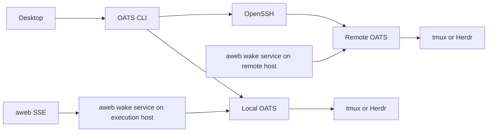

# Execution targets and shared wake delivery

Implementation agreement, 2026-09-05. Lead owns native runtime launch,
local tmux/Herdr adapters and terminal input; oats owns server registration,
remote CLI routing and Desktop target selection. Aweb owns the event listener,
notification state and delivery policy through OATS terminal input. This is the implementation
contract, not a claim that these features have shipped.

OATS manages composition, worktrees, capability lifecycle and retirement on the execution
host. A session backend manages the persistent terminal. Desktop is a client;
closing it must stop neither the agent nor notification delivery.



Server registrations live in the operator's machine configuration, outside
repository configuration. Each entry has an id, label, OpenSSH host alias,
absolute workspace path and OATS/Herdr executable paths. SSH owns key selection,
host verification and authentication. Registration stores no private keys.
Remote lifecycle calls invoke the remote installed OATS CLI with argument-safe
quoting and the same JSON envelope as local calls. Version/envelope compatibility
is checked before mutation. Repository operations always run on that host.

The local representation of a remote instance snapshots its route:

```json
{
  "serverId": "build-server",
  "target": {
    "sshHost": "build-server",
    "workspace": "/srv/team",
    "oatsPath": "/usr/local/bin/oats",
    "herdrPath": "/usr/local/bin/herdr"
  },
  "instance": "developer-fix",
  "home": "/srv/team/agents/developer/instances/developer-fix"
}
```

`serverId` is for display. Later inspect/retire operations use the snapshot,
never silently resolve a changed registry entry. A local cache is not authority
for the remote instance's state. Remote status is pulled from its owning kernel.

The host's instance and independent retirement baseline retain the same local
session receipt. Existing `tmux: {session, window, socket}` remains readable.
New Herdr instances use:

```json
{
  "backend": "herdr",
  "binary": "/usr/local/bin/herdr",
  "socket": "/home/operator/.config/herdr/sessions/oats/herdr.sock",
  "workspaceId": "w1",
  "paneId": "w1:p1",
  "terminalId": "term_65ab9108c6c301",
  "protocol": 20
}
```

The terminal id distinguishes a replacement occupant after a server restart.
Backend operations allocate, start, inspect, stop and attach a viewer. Retirement
compares the receipt with its baseline and proves the original session absent.
An unavailable server or failed inspection is not proof of absence. The same
rule applies to spawn compensation and detached self-retirement. Lifecycle
operations run on the target host, so the local backend does not implement SSH.

Herdr 0.8.2 exposes snapshots, socket commands, agent-state inspection and JSONL
terminal observation/control. Its protocol is versioned. Agent prompts reject
approval-blocked agents, but prompting a working agent does not prove the new
message was processed. The adapter must retain this distinction. See the
[Herdr socket API](https://herdr.dev/docs/socket-api/) and
[remote connections](https://herdr.dev/docs/persistence-remote/).

An aweb host service owns event streams for managed instances; the GUI displays
and controls it. Reuse aweb's existing authenticated event/run loop rather than copying credential
and SSE parsing into OATS or Desktop. OATS exposes backend-neutral session
inspection and literal terminal input; aweb supplies delivery policy. Current authorization is
per identity: one long-lived stream per active identity, coalesced per instance,
with bounded retries. A single team stream requires an explicit server API.
Reconnect also checks pending state so a lost edge does not strand unread work.

Delivery is a fixed instruction to check `aw` mail/chat from the instance home,
not arbitrary sender content typed into a shell. The service never acknowledges
mail or chat on the agent's behalf. Aweb pending hints survive reconnect and service
restart, coalesce while busy and defer at approval prompts. A stopped harness,
an unknown occupant or a fallback shell is not a delivery target. Do not call a
successful terminal write an agent acknowledgement.

Native channels remain selectable during qualification; session delivery must
be exclusive with them for each instance. Removal follows real tests of Pi,
Claude and Codex receiving mail/chat, a busy turn, an approval prompt, reconnect,
service restart, GUI closure and a stopped runtime. The OATS Pi tool extension
and the aweb Pi channel are separate packages; replacing notification transport
does not silently remove unrelated tools.

Acceptance includes local CLI/Desktop spawn, reattach, preserved work and
retirement through both backends; then the same operations on a user-designated
SSH target. Registering a host without a successful remote agent run does not
qualify remote support.

## Session CLI contract

Run on the execution host:

```sh
oats session attach --home /absolute/instance
oats session inspect --home /absolute/instance --json
oats session input --home /absolute/instance --text-file /path/to/message --json
printf '%s' 'Check your pending work.' | oats session input --home /absolute/instance --json
oats session start --home /absolute/instance [--model <id>] --json
```

`start` runs a STOPPED instance again in its existing home: same identity,
worktree, notes and launch environment, no spawn hooks, no new home. It reuses
the persisted launch command, on the recorded tmux session and socket or the
recorded Herdr server, and records the new session target in the instance
metadata and the independent lifecycle receipt (whose home and work
fingerprints are untouched, so a later retire still preserves everything
changed since the original spawn). `--model` replaces the recorded model for
this and later starts by re-rendering the persisted command; a command shape
OATS did not generate is refused rather than rewritten. A live harness is
refused (`E_SESSION_RUNNING`); a fallback shell with no harness descendant
and a dead pane restart in that exact pane, a missing window opens again, and
a lost tmux server after a reboot is recreated on the recorded socket. A state
that cannot be established refuses (`E_SESSION_UNKNOWN`). Every observation
happens under a per-home guard, so two starts of one home serialize
(`E_SESSION_START_BUSY`); a start that allocated a session but could not
record it leaves `.oats-start-pending.json` naming the actual target, and the
next start reconciles that receipt before the ordinary metadata check: a
target that is present is recorded and adopted, one that is provably gone is
dropped, and one that cannot be observed refuses and keeps the receipt.
The start opens a new harness conversation on the instance's `TASK.md`; the
instance resumes its work from its own `STATE.md`, as the knowledge protocol
prescribes.

`attach` is interactive and does not accept `--json`. It validates the saved
endpoint on the execution host, then opens a Herdr terminal viewer or an
isolated tmux session linked to that agent's window alone. Closing its terminal
cleans the viewer without stopping the agent; retiring the agent ends the viewer
instead of switching it to a sibling. This host-local command is also the
remote Desktop attachment seam over an SSH PTY.

Input accepts UTF-8 text up to 256 KiB, with no NUL bytes. The CLI uses the
independent lifecycle receipt and refuses metadata disagreement. Tmux uses
literal bracketed paste followed by Enter. Herdr uses pane input followed by
Enter. Neither path interprets message text as a shell command. A fallback
shell or ambiguous split tmux window refuses automatic input.

Success uses the existing envelope:

```json
{"schemaVersion":1,"ok":true,"result":{"home":"/absolute/instance","backend":"herdr","present":true,"state":"idle","submitted":true}}
```

Inspect omits `submitted`; optional backend identifiers describe the observed
terminal. `state` is the Herdr agent state when available, `unknown` for a live
unclassified harness, `shell` for a fallback shell, `stopped` for an absent/dead
terminal, or `not-launched`. Errors use `ok:false,error:{code,message}` and a
nonzero exit. An unavailable backend is an error, never a stopped result.
Tmux receipts identify socket/session/window; automatic input requires one live
pane in that exact window. Herdr additionally verifies the original terminal ID.
The broker owns busy/approval policy and must not interpret `submitted` as
processing acknowledgement.

Capability spawn hooks register a pending home before runtime allocation;
inspection becomes available once its receipt is persisted. Retire hooks
unregister after quiescence. The broker must tolerate this lifecycle order and
missing homes, and persist pending hints until handled. Kernel session operations
contain no aweb identity, credentials, stream or notification logic.

The portable integration belongs to the official `oats.aweb` capability.
The aweb development deployment currently selects its owned `aweb.identity`
capability; that deployment-specific choice does not change the broker interface
and needs equivalent registration glue when switched to session delivery.

## Shared permission setting

Set `yolo: true` in an `oats-config.yaml` to apply it to that scope. The closest
scope wins; an optional `yolo` in soul.yaml overrides it; `oats spawn --yolo` or
`--no-yolo` overrides both. `oats create` accepts those flags too. Desktop offers
the same per-launch choice. With no setting, native policy is retained.

Codex receives `--yolo` plus a launch-local trust setting for the generated
instance home; Claude receives `--dangerously-skip-permissions`. Pi's existing
project trust behavior is unchanged. `--no-yolo` removes the OATS bypass flags;
it leaves the operator's native harness settings in force. Instance metadata
records an explicitly resolved setting. This choice applies when starting an
agent, not retroactively to running sessions.

Desktop remote terminal requests contain only the server id and instance name.
The selected installed CLI resolves the saved route and performs remote
inspection before attaching over SSH. Pending inspections share the terminal
resource limit and duplicate requests share one inspection. Remote status and
instance keys must include the server so identical paths on different hosts
remain distinct.

## Desktop remote roster and lifecycle

Desktop uses the installed CLI's `server roster --json` feature when advertised.
It refreshes one aggregate roster at a time, independently of terminal traffic;
the CLI owns SSH deadlines, server registration and saved routes. Each target
appears in the workspace selector with its souls and instances. An unreachable
target stays visible with unknown runtime state and an error. A saved route
remains visible after its registration is removed or changed.

Choose the server workspace to spawn one of its souls. A successful launch
switches to that workspace and opens the instance terminal once it appears in
the roster. The instance action menu offers harvest and retirement, including
for stopped agents. Remote harvest runs in the saved home on the execution host;
retirement uses the same saved route and work-preservation rules as the CLI.
Closing a viewer leaves the agent running.

Desktop retirement requires the CLI's `retire-home` feature and always sends
the exact selected home. The remote kernel must support that feature too;
older kernels require an upgrade before the GUI can retire an instance.
This keeps same-named instances distinct. Retirement feedback reports every
preserved recovery path and its classes, including an incomplete cleanup.

This first projection enables terminal and lifecycle actions only for remote
instances with a route saved on this machine. Other observed instances are
listed, but require the execution host's CLI to manage them. Remote brain files
are accessed through the terminal. The roster and remote harvest require CLI
feature tokens `roster` and `harvest`; the published 0.22.2 kernel has remote
spawn, status, retirement and terminals, but not these two additions.
