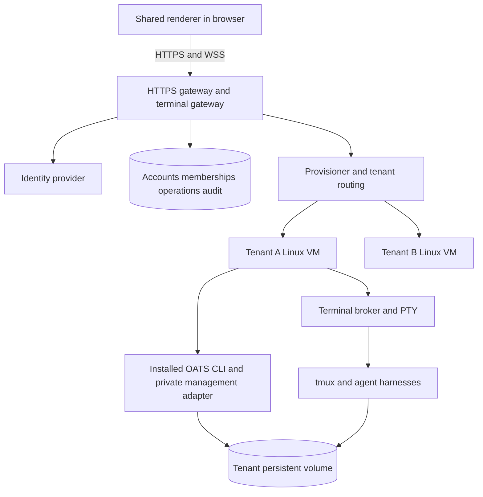

# OATS browser access and Windows support decision proposal

Status: **Draft for maintainer review. No implementation or platform commitment approved.**

Prepared for the human and `oats-expert-juan`. This document compares a hosted,
multitenant browser product with Windows desktop options. It specifies a proposed
hosted MVP in enough detail to review its boundaries, identifies what the current
interface can share, and defines the experiments needed to make a funding decision.
Product and interaction decisions remain with oats-desktop-expert; new security
boundaries, CLI contracts and release signing remain with the maintainer. Kernel
changes, if needed, belong to oats-kernel-developer.

Evidence baseline: repository commit `caf5393d523bc6f6180b07e08191cce9121dfacf`
(Desktop package 0.40.1), inspected on 2026-10-03. Code observations below describe
that snapshot. Proposed APIs, limits, milestones and estimates are design proposals,
not existing capabilities or measured performance. No Windows or hosted prototype
has been run for this assessment.

## Decision to make

The immediate need is to let people without a macOS or Linux computer interact
with OATS instances, spawn them and manage them. The initial request also describes
agents running on a Linux server, with multiple users and tenants.

These are two independent choices: **where the interface runs** and **who supplies
the execution environment**. A Windows executable solves client access; it does
not by itself supply a Linux server, customer accounts or tenant isolation. A
hosted service supplies those, whether its eventual client is a browser or Electron.

Provisional recommendation: if users must arrive with only a browser and receive
managed execution, pursue the hosted browser MVP after a bounded feasibility gate.
If the actual audience already has SSH access to managed Linux deployments and
only needs a Windows interface, evaluate a remote-only Windows client first. If
local execution and customer custody are required, evaluate Windows plus WSL.
Do not make fully native Windows execution the first route to this narrower need.

Reuse one renderer across approved platforms. Do not fund a UI rewrite or a
separate permanent fork as a prerequisite for either option.

## Goals and explicit exclusions

The intended user can select a workspace, see available souls and instance status,
spawn with an opening instruction, use the agent's interactive terminal, reconnect,
and perform approved lifecycle actions. The hosted interpretation additionally
requires account provisioning, tenant isolation, limits, credential management and
an operator capable of supporting the service.

The proposal is complete for decision purposes when it establishes:

1. Which existing code and invariants can be reused, with evidence.
2. What each Windows option does and does not solve.
3. The hosted trust model, data model, request flows and failure semantics.
4. The minimum product scope and the work required beyond a browser demonstration.
5. Cost drivers, uncertainties, acceptance gates, ownership and decision questions.

Initial implementation exclusions: a new conversational transcript UI, local
Windows session backend, arbitrary customer machine onboarding in the hosted UI,
mobile-first interaction, simultaneous collaborative terminal editing, automated
billing, general shell-as-a-service endpoints, and full Desktop feature parity.
An installed Windows app here means an Electron application; a WinUI/.NET rewrite
is a separate option with no demonstrated benefit for this requirement.

## Current implementation evidence

Paths in this section are relative links to the inspected repository code.

| Area | Observed implementation | Consequence |
| --- | --- | --- |
| Renderer | [index.html](../../renderer/index.html), [shell.mjs](../../renderer/shell.mjs), styles and views are browser DOM and ES modules | Layout, themes, roster, tabs, split panes and most feature views can remain shared |
| View boundary | [views/common.mjs](../../renderer/views/common.mjs) accepts injected `ctx.api`, including Fetch responses | HTTP transport need not be embedded in each view |
| Browser harness | [harness.html](../../renderer/harness.html) and [harness-server.mjs](../../renderer/harness-server.mjs) serve views without Electron, with `openTerminal` stubbed | Evidence of browser-oriented views, not evidence of a functional hosted terminal or production shell |
| Host bridge | [preload.cjs](../../preload.cjs) exposes `window.oatsDesktop`; shell assumes it exists | Full shell will not work by serving the current HTML unchanged |
| Terminal UI | [terminal-tab.mjs](../../renderer/terminal-tab.mjs) calls an injected terminal bridge and renders through xterm.js | Display and much lifecycle/UI logic are reusable; network failure semantics need adaptation |
| Native effects | [terminal-io.mjs](../../terminal-io.mjs), [local-tmux-io.mjs](../../local-tmux-io.mjs), [remote-target.mjs](../../remote-target.mjs) create PTYs and attach exact targets | PTY and tmux stay on the execution host for browser access |
| Ownership | [terminal-owner-leases.md](../terminal-owner-leases.md) binds leases to Electron main-frame/document identities | Preserve the ownership invariant; web authentication cannot reuse Electron principal checks unchanged |
| Backend | [server/oats-web.mjs](../../server/oats-web.mjs) is a zero-dependency loopback HTTP process | It is not a public multitenant API; keep this existing boundary private |
| File reads | `fileRoots()` in that server permits roots from all served local deployments and known worktrees | Workspace selection and path containment do not constitute user authorization |
| CLI authority | [desktop-cli-api.md](../../../../docs/desktop-cli-api.md), [cli-adapter.mjs](../../cli-adapter.mjs) use installed CLI JSON and capability probes | Reuse this authority and strict decoding; do not import/reimplement kernel logic |
| Spawn | [desktop-spawn-preview.md](../desktop-spawn-preview.md), [spawn-apply.mjs](../../server/spawn-apply.mjs) implement bounded, in-memory confirmed local spawn transactions | Persist hosted operation custody around the CLI; do not assume broker memory survives restart |
| Remote spawn | Same document and [spawn-preview.mjs](../../server/spawn-preview.mjs) distinguish local confirmed preview/apply from ordinary server-routed spawn | A Windows remote client needs its own parity gate; present remote support is not proof of identical transaction semantics |
| Observation | [desktop-load-path.md](../desktop-load-path.md) describes held snapshots, coalescing and adaptive cadence | Preserve coalescing; do not run a CLI observation cycle per browser tab |
| Packaging | [electron-builder.config.cjs](../../electron-builder.config.cjs), [build-installers.yml](../../../../.github/workflows/build-installers.yml) target macOS and Linux | Windows requires a real build, native dependency and release qualification effort |

The current backend has Host/Origin loopback guards, not customer login and
resource authorization. Existing route names, arbitrary local paths and terminal
target specs must not become a public interface merely by placing a login proxy
in front of the process.

The current terminal is a live byte stream, not an image of a window and not a
structured chat transcript. A viewer links to the durable tmux source window;
closing the viewer must not stop the agent. This is the behavior to preserve.

## Options and comparison

| Option | Client | Agent execution | What the user must supply | Main additional work |
| --- | --- | --- | --- | --- |
| A Hosted web | Browser | Service-managed Linux environment per tenant | Account and approved repository/model access | Account service, isolation, runner operations, web transport, ongoing hosting |
| B Windows remote client | Installed Electron app | Existing customer/operator Linux server | Windows installation, server access and credentials | Windows port, remote onboarding, CLI/SSH compatibility, signed distribution |
| C Windows with WSL | Installed Electron app with WSL adapter | Linux inside WSL on the user's Windows computer | Permission and resources to install/run WSL | WSL provisioning, process/path bridge, lifecycle and local integration qualification |
| D Fully native Windows | Installed Electron app | Windows processes without WSL | Windows installation and native toolchain | Kernel/session backend and capability portability, then Desktop support |

| Criterion | A Hosted web | B Windows remote | C Windows with WSL | D Native execution |
| --- | --- | --- | --- | --- |
| No client installation | Yes | No | No | No |
| No user-managed Linux environment | Yes | Only if someone else manages the server | Linux still present locally | Yes, after a larger port |
| Runs when laptop sleeps | Yes, subject to service availability | Yes, on remote host | No dependable promise | No dependable promise |
| Local code custody | No, code is hosted | No for server execution | Yes | Yes |
| Service must manage tenants | Yes | Only if we also supply hosting | No for individual local use | No for individual local use |
| Other client operating systems | Browser reach | Separate app builds | Windows only for this adapter | Windows only for this backend |
| Ongoing vendor compute cost | Material | Low if users supply servers | Low | Low |
| Principal uncertainty | Service security and economics | Windows CLI/SSH and remote feature parity | Reliable WSL lifecycle and onboarding | Size of kernel/provider portability work |

These are qualitative judgments, not benchmark scores. If option B connects to
our managed hosting, it inherits option A's tenant and operations work and adds
Windows distribution. It is then an additional client, not a cheaper substitute
for the service.

## Shared interface design

Introduce one explicit platform object at renderer startup. The Desktop adapter
wraps the existing preload API; the web adapter implements network operations.
Views continue to receive `ctx` rather than importing transport code. Move direct
`window.oatsDesktop` access behind that boundary gradually, retaining compatibility
while existing Desktop tests run. The interface names below are illustrative.

| Platform capability | Desktop behavior | Hosted behavior |
| --- | --- | --- |
| `api` | Guarded IPC proxy to local backend | Same-origin authenticated HTTPS to a closed gateway API |
| Terminal open/ready/write/resize/close/events | Existing document-owned IPC leases | Connection-owned authenticated terminal protocol |
| Workspace catalog and selection | Registered deployments and Desktop windows | Authorized tenant/workspace catalog and browser route |
| Attachments | Native path extraction/copy and remote upload | Bounded browser upload to the selected tenant; no local path authority |
| Focus/activity | Electron app/window events | Visibility/focus state, reduced across active subscribers server-side |
| Clipboard | Current native/browser integration | Browser permission and gesture rules with visible failure |
| Local workspace/CLI selection | Native pickers | Capability absent; administrator-provisioned runtime status instead |
| Forge credentials | Desktop-owned sign-in flow | Hosted credential onboarding, separately designed and authorized |

Preserve the visual shell, roster, spawn forms, terminal typography, split controls,
loading states, inspector components and semantic theme tokens. Preserve latest-
intent checks on success and rejection. Add capability-driven navigation so an
unsupported action is not shown as a dead button. Capability flags are presentation;
the server independently enforces every permission.

The public hosted DTOs use opaque resource IDs. A compatibility mapper may preserve
existing view shapes where harmless, but internal home paths and tmux socket names
must not become terminal authority. Views that currently construct path selectors
need explicit changes. API parity is not assumed to be byte-for-byte parity.

Web-specific changes include login/account chrome, workspace routes, reconnect
status, browser-reserved shortcuts, upload handling, asset bundling and an HTTPS/WSS
CSP. Do not serve `node_modules` as the production asset strategy. Bundle reviewed
browser dependencies into immutable, versioned assets. Avoid third-party scripts
on terminal pages and never interpret terminal bytes as HTML.

Namespace remembered layout and selection by account, tenant and workspace, and
clear sensitive state on logout/account switch. Do not cache terminal streams or
tenant API responses in a service worker. Two browser tabs may show one workspace;
Desktop's one-window-per-workspace policy does not automatically carry over.

Retain the current keyboard and accessibility foundations. Qualification must cover
Windows Ctrl shortcuts, browser conflicts, IME, focus restoration after dialogs,
screen-reader announcements, reduced motion, zoom and computed AA contrast. These
need the accessible-desktop-interactions workflow when implementation begins.

## Hosted system responsibilities



The control plane owns accounts, membership, quotas, provisioning and operation
custody. It never executes user repositories or launches agents in its own process
environment. The tenant runner owns a compatible installed CLI, workspace clones,
agent processes and local terminal resources. An adapter invokes the installed CLI
with fixed executable/argv and strict JSON decoding, preserving the existing
Desktop contract and capability gates.

For the MVP, use one tenant VM and one approved deployment per tenant. Multiple
workspaces in one environment are a later organizational convenience, not an
isolation boundary. A tenant starts as one person; multiple trusted members can be
added after membership and revocation tests pass. Horizontal scaling assigns whole
tenant environments to hosts. Do not move a running tmux session between machines.

Keep the current Desktop backend zero-dependency and loopback-only. Reuse pure
decoders and CLI adapters in a private runner component; a narrow local proxy to
selected existing routes is an implementation option after endpoint review. Never
expose the entire existing route tree. Authentication, database and WebSocket
dependencies belong to a new private hosted package or repository, not the root
kernel package. Final package placement needs maintainer approval.

The runner channel is mutually authenticated and private, with credentials bound
to one tenant and an environment generation. No runner credential can provision
machines, read the control-plane database or name another tenant. Prefer an
outbound runner connection to reduce inbound exposure. A stale VM restored from
backup must not regain authority using an old runner credential.

## Trust and tenant isolation

Threats include malicious customers, compromised browser sessions, hostile
repositories and dependencies, prompt-induced agent actions, terminal escape
payloads, guessed resource IDs, abandoned sockets, and a tenant exhausting compute
or storage. A compromised tenant environment must not reach another tenant or the
hosting control plane.

Proposed compute boundary: a VM per tenant, running workloads without host
administration rights. Harden the host and guest, restrict access to cloud metadata,
platform management networks and other tenant networks, and enforce quotas outside
the agent's authority. No shared host filesystem mounts, Docker sockets, SSH agents
or broad cloud credentials. Containers inside a tenant VM can organize processes,
but are not the sole initial customer boundary. This recommendation is our design
judgment; Docker documents how capabilities, mounts and kernel vulnerabilities
affect container isolation. [Docker security](https://docs.docker.com/engine/security/)

Separate the runner supervisor's management identity from the Unix account running
agents. Agents may execute arbitrary code as the workload account, but cannot read
the supervisor key or change admission limits. The supervisor exposes a closed
operation vocabulary, not an arbitrary executable/cwd/environment RPC. Treat all
runner replies as untrusted structured input and bind them to the expected tenant,
environment generation and request. This separation needs an actual privilege and
filesystem audit; a different process under the same Unix account is insufficient.

All operators within one tenant are trusted with that tenant's execution data.
Terminal control or spawning code can expose credentials and files available to
the workload, even if the web UI hides a settings page. Therefore fine-grained
per-instance confidentiality is not promised inside one tenant. Separate mutually
untrusted users into separate environments. A reader role can view secrets printed
in output; granting it is a data-access grant.

Every database row, cache entry, operation, artifact and terminal session carries
server-verified tenant scope. Client tenant IDs select a requested context; they
do not prove membership. Use scoped database queries and composite foreign keys;
if row-level security is selected, use request roles that cannot bypass it and
transaction-scoped context. Isolation tests must exercise direct object references,
jobs, caches and backup restore, not just list filtering. [OWASP multitenant guidance](https://cheatsheetseries.owasp.org/cheatsheets/Multi_Tenant_Security_Cheat_Sheet.html)

## Accounts and permissions

Use an established identity provider through OIDC rather than storing passwords in
the OATS service. The provider is not selected in this proposal. Maintain an
application membership record and revision separate from provider authentication.
Require MFA for tenant owners and platform administrators before production.
Use secure, HttpOnly session cookies, appropriate SameSite settings, CSRF protection
for state changes and explicit Origin validation for terminal handshakes.

Initial roles:

| Action | Reader | Operator | Owner |
| --- | --- | --- | --- |
| Roster, status, approved artifacts | Yes | Yes | Yes |
| Read-only terminal observation | Later phase only | Yes | Yes |
| Terminal input, spawn, start, stop | No | Yes | Yes |
| Retire instance after plan confirmation | No | Yes | Yes |
| Invite/remove members and change roles | No | No | Yes |
| Configure credential references and tenant limits | No | No | Yes, within platform limits |
| Delete/export tenant | No | No | Yes, with fresh authentication |

In the pilot, one owner per tenant is sufficient, but all requests still pass
membership enforcement. Later membership invites are expiring, single-use and
bound to the intended identity. Prevent removal of the final owner without an
explicit ownership transfer. Platform support has no default terminal or file
access; exceptional access is time-limited and audited under a separate policy.

Revocation increments membership/session authority, blocks new operations and
closes active terminal access. Proposed acceptance target: within five seconds
in a healthy system; on loss of authority validation, the terminal gateway fails
closed within the same lease freshness bound. An already-started CLI effect may
finish and must be recorded; do not represent revocation as rollback.

OATS/aweb teams remain agent identity and messaging constructs. A website tenant
membership does not automatically create an aweb team membership, and vice versa.
Provisioning any messaging identity must use approved OATS/provider commands.
Hosted custody must be described accurately; server-accessible credentials and
terminal content are not end-to-end encrypted from the service operator.

## Persistent service data

Use a transactional database for service authority and job custody. The kernel
remains the source of truth for OATS lifecycle and workspace facts. Do not maintain
a second writable model of kernel state.

| Record | Required fields and rules |
| --- | --- |
| User | Opaque ID, identity-provider issuer and subject, account status; email is display/contact, not immutable identity |
| Tenant | ID, status, quotas, region, retention policy, owner relationship |
| Membership | Tenant/user pair, role, revision, active/revoked state; unique pair |
| Environment | Tenant ID, opaque ID, generation, runner identity, image version, health and volume references |
| Workspace registration | Tenant/environment IDs, public ID, runner-owned CLI scope reference; no browser-authoritative absolute path |
| Instance observation | Tenant/workspace IDs, opaque ID, kernel identity/incarnation binding, observed status/time; replaceable cache, not lifecycle authority |
| Operation | Tenant, actor, membership revision, kind, target incarnation, immutable request digest, idempotency key, CLI decision/plan, state and bounded receipt |
| Terminal lease | Tenant, actor, browser connection, instance incarnation, runner generation, control fencing number, expiry and cleanup status |
| Credential reference | Tenant, provider, secret-store reference, scope and rotation status; no plaintext secret in ordinary rows |
| Audit event | Actor, tenant, action, target ID, request/operation ID, time and result code; no terminal bytes or credentials |
| Artifact | Tenant, owner operation/instance, storage key, size/hash/type, retention state |

Kernel paths stay internal to runner mappings. Public IDs are not authorization
tokens. Jobs retain the authenticated actor for attribution but recheck current
permission before dispatch. Restored environments receive new generations and
invalidate terminal leases and pending plans from the prior incarnation.

## Proposed public management contract

The following routes are a reviewable vocabulary, not approved endpoint names.
All target operations require active membership, ownership validation and a live
compatible runner. Resource absence outside the caller's scope is returned without
disclosing another tenant's existence.

| Route family | Purpose |
| --- | --- |
| `GET /v1/session` | Current user and authorized tenant summaries |
| `GET /v1/tenants/{t}/workspaces` | Authorized workspace choices |
| `GET .../workspaces/{w}/souls` and `/instances` | Held observations with age and failure state |
| `POST .../workspaces/{w}/spawn-previews` | Validate allowed choices and obtain kernel-bound preview |
| `POST .../workspaces/{w}/spawn-operations` | Confirm one preview and submit a durable operation |
| `GET .../operations/{o}` | Inspect exact outcome; never implicitly retry |
| `POST .../instances/{i}/lifecycle-plans` | Obtain stop/retire plan for current incarnation |
| `POST .../instances/{i}/lifecycle-operations` | Confirm and apply the exact plan |
| `POST .../instances/{i}/terminal-leases` | Request a connection-owned terminal capability |
| `POST .../instances/{i}/attachments` | Later: bounded upload into an approved attachment location |

Do not forward public generic CLI execution, executable selection, arbitrary
server registration, raw paths or environment variables. In particular,
Desktop's CLI reprobe with a selected binary and its local file API are not public
hosted endpoints. Initial read-only artifact support uses an authorized listing
and opaque file IDs; downloads remain scoped and traversal/symlink guarded.

Return a versioned service envelope with a request ID, stable service error code
and an explicitly projected kernel receipt/error where appropriate. Proposed
service codes include `AUTH_REQUIRED`, `ACCESS_DENIED`, `RUNNER_UNAVAILABLE`,
`CLI_INCOMPATIBLE`, `PLAN_STALE`, `QUOTA_EXCEEDED`, `OPERATION_UNKNOWN` and
`TERMINAL_CONTROL_BUSY`. These do not rename or expand the kernel JSON contract.

## Spawn and lifecycle flows

Hosted operations run the CLI locally inside the selected tenant environment.
That deliberately uses the existing local preview/apply semantics even though
the user's browser is remote. No new kernel remote transaction is assumed.

Spawn sequence:

1. Authorize tenant, workspace and operator. Resolve an allowed soul from the
   runner's CLI catalog and validate the closed choices schema.
2. Run capability-gated preview. Bind its decision to actor, tenant, environment
   generation, workspace and choices. Store an expiring preview record. Opening
   instructions are not sent to a read-only preview when the CLI contract excludes them.
3. Show kernel-reported effective launch, placement and readiness, plus applicable
   service quota information. Refusals remain actionable without implying launch.
4. On confirmation, reauthorize and transactionally reserve quota and an operation
   record. The same client intent/digest reuses the same record; a changed digest
   under that key is a conflict. Persist the CLI idempotency key before dispatch.
5. The runner records operation custody before invoking the fixed CLI argv. It
   rechecks the exact decision and target; CLI drift refusal requests a fresh
   preview, never silent substitution.
6. Persist a bounded receipt, observe the instance through the CLI, and return its
   public ID. Auto-open the terminal only if the user's latest selection still owns
   the result. Otherwise retain a discoverable completed operation.

Proposed service states: `prepared`, `queued`, `running`, `succeeded`, `refused`,
`partial`, `unknown`. Queue acceptance is not proof of spawn. Quota reservations
are released only after a confirmed no-effect result or reconciled outcome.
Operations that may still run retain their reservation.

Browser retry uses the same operation ID. Gateway crash does not mint a new CLI
key. Runner recovery uses only the current CLI's supported exact receipt and
idempotency semantics. The existing kernel key lifetime is tied to its surviving
home; do not promise forever-exactly-once creation or replay after retirement.
If recovery cannot establish what happened, mark unknown and require reconciliation
against exact identity/incarnation. Never infer success from a same-named instance.

Stop and retire preserve the existing plan/confirm/apply contract and retention
warnings. Retire is not synonymous with deleting every worktree or retained file.
Start/restart use their actual advertised CLI contract; do not claim idempotency
for verbs that do not supply it. A disconnected caller can inspect its operation
later without causing a retry. Service quotas also cover descendants spawned by
agents: VM/process/disk limits must hold even when the UI gateway is bypassed.

## Terminal protocol and ownership

The terminal gateway bridges xterm.js to a PTY attached to an exact authorized tmux
source. Keep tmux target validation, `=` anchoring, linked-window viewers, source
death isolation and locked viewer keys. Port the lifecycle guarantees from
[terminal-owner-leases.md](../terminal-owner-leases.md); do not transplant Electron
sender-frame checks into a web principal model.

Proposed attachment flow:

1. A management request resolves an authorized public instance ID and incarnation.
   Reserve a bounded terminal slot and acquire the instance's writer lease.
2. Issue a short-lived, single-use opaque ticket bound to user session, tenant,
   instance, browser tab nonce and environment generation. Keep it in memory. Do
   not put it in URLs or logs. Connect to a fixed same-origin WSS endpoint, then
   authenticate with a bounded first message while the connection has no PTY or
   data privileges. Limit and promptly expire unauthenticated sockets.
3. Consume the ticket atomically, validate the cookie session and Origin, and open
   a private viewer. Send readiness only after client listeners are installed.
4. Exchange typed `input`, `resize`, `output`, `ack`, `status` and `close` messages.
   Validate frame type, length, sequence and current fencing number. Server output
   never becomes executable page content.
5. On disconnect, revoke input immediately and close the viewer/PTY. Reconnection
   acquires a fresh lease and viewer; it does not replay input or resurrect a handle.
   The durable source survives browser closure. Uncertain viewer cleanup remains
   accounted for and is reconciled by an exact owned-viewer sweep.

TLS, explicit Origin checks, session expiration/revocation and authorization beyond
the initial connection are required; WebSockets do not supply them automatically.
[OWASP WebSocket security](https://cheatsheetseries.owasp.org/cheatsheets/WebSocket_Security_Cheat_Sheet.html)

First release: one writer per instance. A second tab sees who holds control and a
clear refusal. Automatic takeover is disallowed while an old writer remains valid.
A later explicit takeover must revoke and fence the old writer before enabling the
new one. Shared read-only viewers are deferred because independent tmux clients can
also influence sizing and resource use. A reader stream must not resize or write.

Keep network input semantics honest: an input acknowledgement can mean accepted
into the current PTY, not that the agent processed it. Do not retry keystrokes after
an uncertain disconnect. On reconnect, obtain a fresh terminal repaint; full
scrollback/transcript restoration is not promised. Browser sleep and background
timer throttling must not cause reconnect storms.

Backpressure is required in both directions. Use bounded gateway/runner queues,
output sequence acknowledgements tied to xterm write completion, and explicit
overflow failure. Pausing a PTY must be bounded so a slow browser cannot indefinitely
stall a workload; detach an over-budget viewer while preserving the source. Choose
thresholds through measurement. xterm's flow-control guidance explains the buffering
problem and write-completion mechanism. [xterm flow control](https://xtermjs.org/docs/guides/flowcontrol/)

Starting limits for evaluation, not promised defaults: retain Desktop's 1 MiB
caller-write ceiling, split UTF-8 safely, validate geometry within 1–1000 cells,
and cap terminals per user and tenant as well as globally. Keep small readiness
buffers and deadlines. Browser clipboard access requires an explicit policy for
OSC 52, user activation and refusal; terminal output cannot read the clipboard.

## Credentials repositories and provisioning

Provision from a pinned Linux image containing approved Node/OATS/harness versions,
tmux and Git. Image build provenance and capability probes determine supported
features. A missing or incompatible CLI disables mutations and reports the issue;
it never triggers an optimistic command attempt or alternate implementation.

Pilot onboarding is administrator-assisted: create tenant, allocate VM/volume,
establish restricted runner identity, register approved workspace sources, configure
model/repository credentials, perform readiness checks, and admit the owner. Each
step has durable state and can be retried without duplicate resources. A failed
provision remains unavailable with a concrete remediation; it is not a partially
usable tenant. Provisioning uses CLI/provider commands, never hand-edits kernel
deployment or identity files.

Select a credential model before launch: customer-supplied provider credentials or
platform-funded model access. Validate the supported authentication method for each
harness and the provider's current hosted-use terms in a separate provider review.
This proposal makes no claim that a consumer subscription or browser login may be
shared, automated or resold. Credentials remain on the server; the browser receives
status and references, never a reusable secret after onboarding.

Encrypt secrets at rest, scope repository tokens narrowly, audit rotation and
revoke on tenant offboarding. Inject only tenant workload credentials into agent
processes. Platform database, billing and infrastructure keys never enter the
tenant. Workload credentials are exposed to tenant code by design; encryption at
rest does not hide them from that code or the service operator.

Separate service-account login from Git/model login in the UX. Never ask users to
paste infrastructure credentials into a terminal as the standard onboarding flow.
MVP uses approved workspace templates; arbitrary source registration and messaging
team setup require their own authorization and product design.

## Operations resilience and retention

Run agent sessions independently of gateway lifetime and browser presence. Upgrade
the gateway by draining connections and allowing reattachment. Upgrade runner/CLI
images only through a compatibility gate; do not silently replace the CLI during
an in-flight mutation. Do not use machine suspension as an idle optimization while
an agent or schedule is expected to run.

| Failure | Required behavior |
| --- | --- |
| Browser tab closes or network fails | Revoke/detach its viewer; instance continues; no automatic input replay |
| Gateway restarts | Durable operations remain queryable; terminals reconnect with new authority |
| Runner channel fails | Show last observation as stale; block new effects; reconcile pending operations |
| VM reboots or is lost | Report sessions interrupted; tmux does not survive reboot; restore files and use supported session recovery explicitly |
| Membership revoked | Block admission, fence active sockets, record any already-started effect |
| CLI missing or incompatible | Observation where available, no lifecycle mutations |
| Disk full or process limit reached | Stable failure, quota remains conservative until reconciliation |
| Slow terminal consumer | Bounded buffering and detach; no unbounded memory growth |
| Backup restored | New environment generation, rotated runner authority, no revived old terminal lease |

Use persistent tenant volumes and encrypted backups. Backups preserve files and
records, not live process memory. Define a pilot restore target with the operator
before acceptance; proposed targets are at most 24 hours of file loss and restore
within one working day, explicitly not a production SLA. Test restore into an
isolated environment without duplicate messaging identities sending concurrently.

Initial proposed retention policy for review: no central terminal-content logs;
service audit metadata 90 days; operation metadata/receipts 30 days; encrypted
backups 30 days; deleted tenant data purged from active storage after a seven-day
owner recovery window and from backups as they expire. Customer-specific retention,
regional restrictions and legal obligations must be resolved before onboarding.
Local agent transcripts may still exist on tenant storage and must be included in
the disclosed retention/export policy.

Offboarding disables login/runner admission, revokes sockets and credentials,
stops jobs under an explicit policy, offers an authorized export, and tracks active
volume and backup deletion separately. Export never includes platform identities.
Suspension for nonpayment is a later policy; it must not silently destroy work.

Monitor runner health, observation age, queue age, operation failure/unknown rates,
terminal slots/buffer pressure, CPU/memory/disk, cross-tenant authorization failures
and cost by tenant. Logs contain identifiers and error codes, not prompts, terminal
bytes, tokens or arbitrary CLI stderr. Redaction is secondary to not collecting
secrets. Support tooling must respect the same tenant boundaries.

## MVP scope and user journeys

The first hosted pilot has desktop-sized browsers, invite-only accounts, one owner
and one workspace/environment per tenant, a limited approved soul catalog and
administrator-assisted credentials. It includes login, workspace selection,
instance list/tree, spawn preview/confirmation, interactive terminals, reconnect,
status/attention, start/stop/retire and operation outcome recovery.

Opening journey: login → authorized workspace → current roster or explicit
provisioning/error state. Spawn journey: choose soul → instruction/allowed choices
→ preview/readiness → confirm → visible operation → resulting instance. Resume
journey: return to a running instance → attach to the exact source → continue.
Removal journey: inspect CLI plan and retained work → confirm → exact receipt.

No native binary/folder pickers appear in hosted flows. Read-only Markdown/artifact
viewing can follow once scoped file authority is implemented. Attachments,
organization membership UI, read-only shared terminals, automations, forge review,
arbitrary remote machine registration and mobile layouts follow separate gates.

A service that can only list instances or show captured output is a feasibility
demo, not this MVP. Conversely, native integration parity is not required to prove
the specified user journeys.

## Windows architecture choices

### Remote-only Windows client

Retain Electron, shared renderer and isolated preload. Run agents/tmux on an existing
Linux server. Two transport implementations must be evaluated rather than mixed
implicitly: use a Windows-compatible installed OATS CLI routing through SSH, or use
a separately approved private Linux management adapter reachable through a secure
tunnel. The latter avoids porting the local CLI but introduces a new management
transport and deployment requirement; it is not already available as a product.

Existing `remote-target.mjs` still invokes a local OATS executable for inspect and
attach. Consequently existing remote support does not prove Windows works without
a compatible local invocation strategy. The spike must exercise probe, roster,
spawn, start/stop/retire, PTY attach, upload and cleanup, not merely `ssh` in a window.

Windows-specific work includes CLI discovery and `.cmd` launch behavior without
unsafe shell interpolation, PATH/PATHEXT, POSIX remote path handling on a Windows
host, SSH identity/known-hosts UI, terminal child cleanup, native module ABI builds,
icons/installers, update/uninstall behavior, security software compatibility and
signing. Existing macOS/Linux guards and release outputs remain unchanged.

Concrete audit targets in this snapshot:

- `cli-locator.mjs` searches PATH for extensionless `oats`; the backend's fallback
  assumes an npm `bin` directory and `/bin/sh`. `login-path.mjs` already skips its
  login-shell probe on Windows, but that does not make backend discovery portable.
- The current CLI descriptor is a single binary path, also spawned directly by the
  remote terminal adapter. A safe Windows launcher may need an executable plus a
  validated argument prefix, such as installed Node plus the installed CLI entry
  point. Such a change spans consumers and requires coordinated review.
- The workspace registry admits `/`-absolute local paths; remote-machine setup
  currently derives scope from a primary local deployment. A Windows remote-only
  first-run flow therefore needs a designed trusted workspace bootstrap, not merely
  a new connection button. See [desktop-machines.md](../desktop-machines.md).
- [lib/servers.mjs](../../../../lib/servers.mjs) uses host-native path resolution
  in remote-home comparisons. Audit these on Windows against POSIX address
  semantics; this is an identified portability risk, not a reproduced Windows bug.
- [dist-smoke.mjs](../../scripts/dist-smoke.mjs) assumes non-macOS artifacts are
  Linux packages, and [smoke-probes.mjs](../../scripts/smoke-probes.mjs) launches
  `/bin/sh`. Windows qualification needs platform-specific probes.

Use distinct internal types for Windows local paths, WSL paths plus distribution
identity, and Linux remote paths plus server identity. Do not make one permissive
path validator cover all three.

Electron and node-pty offer Windows primitives, including ConPTY, but their current
upstream support does not qualify OATS's pinned Electron/node-pty combination.
[Electron documentation](https://www.electronjs.org/docs/latest/),
[node-pty documentation](https://github.com/microsoft/node-pty).
Node documents that `.cmd` files cannot be executed as native programs through
`execFile`; use a reviewed invocation strategy instead of general `shell: true`.
[Node child processes](https://nodejs.org/api/child_process.html#spawning-bat-and-cmd-files-on-windows)

Windows OpenSSH availability is a supported platform facility, but installation,
host enrollment and organization policy still need checking. Existing OATS SSH uses
batch mode, so interactive password or first-host-key prompts are not an onboarding
solution. Public app distribution also needs signing/trust decisions; signing does
not justify promising that every OS warning disappears.
[Microsoft OpenSSH overview](https://learn.microsoft.com/en-us/windows-server/administration/openssh/openssh-overview),
[Electron code signing](https://www.electronjs.org/docs/latest/tutorial/code-signing).

Remote servers must authenticate the user and grant appropriate Unix/OATS access.
If all users share one Unix account, they share its effective filesystem and agent
authority; installing separate Windows clients does not establish tenancy.

### Windows app with WSL execution

Run OATS, Git, tmux and harnesses inside one selected WSL Linux distribution. The
Windows app discovers and binds to that distribution explicitly. Keep CLI scope,
paths, process environment and tmux identity in the Linux domain, with a structured
bridge to the Windows UI. Do not translate paths by string replacement or allow a
distribution change to retarget an in-flight operation.

Prefer workspace storage on the Linux filesystem for Linux tooling. Native files
are copied/uploaded deliberately. Credential stores and SSH agents live in the
selected Linux environment unless a reviewed integration says otherwise. Explain
where code and credentials reside, how much disk/memory is required and how to
export before uninstalling the distribution.

The installer must detect unsupported/disabled WSL and organization policy without
assuming it can enable Windows features or reboot. Test shutdown, reboot, sleep,
distribution removal, concurrent distro names, and same-named instances in different
distributions. WSL shutdown ends processes; reconnection is not proof of resumed
agent work. This option serves users allowed to run local Linux under Windows,
not users prohibited from doing so.

Microsoft's standard WSL installation procedure uses an administrator terminal and
a restart; forwarded WSL paths use Linux syntax, and its guidance recommends Linux
filesystem storage for Linux tooling. These are onboarding constraints, not proof
that WSL is unavailable on every managed device.
[Install WSL](https://learn.microsoft.com/en-us/windows/wsl/install),
[WSL filesystem interoperability](https://learn.microsoft.com/en-us/windows/wsl/filesystems).

### Fully native Windows execution

ConPTY can host interactive Windows processes, but a PTY is not a durable session
manager. Current OATS uses tmux sessions and POSIX-oriented hooks/process behavior.
A native Windows implementation requires a kernel-owned durable session backend
with identity, inspect, attach, resize, input, source/viewer lifetime, stop and
restart contracts, plus capability/provider and filesystem portability.

That exceeds the Desktop surface and must be designed by the kernel maintainer and
developers. Merely removing a tmux check, running a harness in node-pty, or adding
a Windows installer would not deliver equivalent lifecycle behavior. This option
should be reconsidered only if local execution without WSL is a validated product
requirement that justifies that platform program.

The evidence goes beyond tmux: [core.mjs](../../../../lib/core.mjs) launches through
`/bin/sh`, materializes symlinks and accepts the tmux session backend;
[process-group.mjs](../../../../lib/process-group.mjs) uses POSIX process-group
signaling; [session-viewer.mjs](../../../../lib/session-viewer.mjs) implements tmux
viewer lifetime. Upstream tmux's current supported-platform list does not include
Windows. That does not rule out ports or compatibility layers, but they are not
evidence that the existing OATS lifecycle contract works natively.
[tmux supported platforms](https://github.com/tmux/tmux/blob/master/README)

## Delivery plan and decision gates

Do not begin production implementation solely on this proposal. The requested
review decides which time-boxed spikes and owners to fund.

| Gate | Work | Evidence required | Stop condition |
| --- | --- | --- | --- |
| 0 Audience and ownership | Confirm managed hosting vs existing servers vs local custody, target devices, credential model and service operator | Written choice and budget owner | No operator/budget for hosted service, or audience requires unsupported local custody |
| 1 Shared renderer | Load real shell through a browser adapter against a private single-tenant runner; retain Desktop adapter | Same roster/spawn/terminal UI, no Electron globals leaking into browser path, Desktop regressions pass | Extraction needs uncontrolled UI fork or cannot preserve identity semantics |
| 2 Windows spike | Run B on actual clean Windows; separately test C if local execution matters | Full target user journey and failure/cleanup evidence | Missing CLI/remote contracts or unacceptable WSL install policy |
| 3 Hosted isolation spike | Two tenant VMs, authorized gateways, durable spawn and WSS lease ownership | Cross-tenant denial, revocation, crash/retry and resource-limit tests | Any uncontrolled access across tenants or into infrastructure |
| 4 Comparative review | Update measured effort, latency, onboarding friction and monthly model | Human and maintainer select product path | Cost/support burden outweighs audience benefit |
| 5 Pilot | Small invite-only cohort on selected option | All MVP acceptance criteria and named support owner | No reliable recovery, secret handling or operating capacity |
| 6 General release | Harden operations/distribution, capacity and documentation | Security review and platform acceptance; explicit launch decision | Pilot reliability/economics do not meet agreed targets |

Shared renderer work is useful across options, but avoid prematurely extracting
every Desktop module into a public library. First prove one complete feature and
terminal lifecycle through both adapters. Preserve versioned interfaces and contract
fixtures. Roll out behind an explicit platform entry point, leaving the current
Desktop launcher default intact. Rollback disables hosted admission and retains
tenant work; it must not delete workspaces.

## Verification and acceptance

Implementation gates must use real effects where mocks cannot establish behavior.
Desktop-only changes run `cd packages/desktop && node --test`; repository changes
also run `npm run validate` and `npm run check`. Packaging changes require installer
and appropriate tarball gates. Terminal/identity changes need native verification
with exact tmux state before and after; use electron-live-verification for Desktop.

Hosted acceptance:

1. Two unrelated tenants complete spawn/attach/manage without seeing each other's
   list, file, output, job, preview, ticket, cache or export data, including guessed IDs.
2. A revoked user cannot retain a writer socket, reuse a ticket or dispatch a queued
   mutation. An expired invitation/session cannot acquire fresh authority.
3. Browser reload, tab close, gateway crash and lost acknowledgements never create
   a second instance from the same accepted intent or kill the durable source viewer
   was attached to. Unknown outcomes remain explicit where proof is unavailable.
4. Same-named instances, retired/recreated homes, workspace switches and environment
   replacement cannot retarget a stale operation or lease.
5. Huge output, slow clients, malformed frames, invalid UTF-8/control messages,
   excess terminals, process floods and full disk stay within quotas and bounded
   queues. Unicode terminal input and valid control bytes remain correct.
6. Clipboard, IME, paste, resize, wheel scrollback, terminal application mouse mode,
   keyboard navigation and focus behavior work in the supported browser matrix.
7. Restore proves file recovery and identity isolation; UI explicitly distinguishes
   restored files from restarted processes and resumed harness conversations.
8. No provider or platform credentials appear in browser payloads, public URLs,
   logs, audit metadata or another tenant's environment.

Proposed first browser matrix: current Chrome and Edge on Windows, plus Firefox
and Safari desktop qualification before claiming general browser support. Publish
the actual tested versions at release. ARM Windows and mobile are not implicitly
covered by x64 tests.

Proposed measurement targets, to be validated rather than advertised: local UI
selection feedback under 100 ms; terminal input-to-display overhead attributable
to our bridge under 50 ms at p95 on a nearby runner, excluding network and harness
compute; stable memory during a 30-minute sustained-output test; revocation within
the five-second authority bound. Record RTT and raw latency distributions. Kernel
catalog/preview operations can be slow; show age/progress instead of inventing a
subsecond promise. Begin with 10 tenants and 20 simultaneous terminal connections
as a load-test scenario, not a production capacity claim.

Windows acceptance additionally requires clean install without developer PATH,
paths containing spaces/non-ASCII, correct remote POSIX paths, SSH host-key failure,
credential recovery, kill/relaunch, sleep/resume, native module loading, uninstall
without workspace loss, and exact source/viewer cleanup. Test the signed release
artifact, not just development Electron. A Windows VM/physical test environment is
required; none was used in this assessment.

## Effort and operating economics

These are low-confidence planning allowances, not delivery quotes. One engineer-
week means a full-time experienced engineer with necessary reviewers and test
machines available. Workstreams overlap; person-time does not translate directly
to calendar time. Update all estimates after gates 1–3.

| Work | Initial allowance | Major uncertainty |
| --- | --- | --- |
| Shared renderer feasibility | 1–2 engineer-weeks | Shell globals, identity DTOs, terminal lifecycle coupling |
| Windows remote feasibility | 1–2 engineer-weeks | CLI execution and remote spawn parity |
| WSL feasibility if required | 1–2 additional engineer-weeks | Provisioning policy, process and path bridge |
| Hosted two-tenant feasibility | 2–4 engineer-weeks | Runner authority, operation recovery and WSS fencing |
| Windows remote pilot after a successful spike | 4–8 additional engineer-weeks | Onboarding, signing and installed-app qualification; excludes new kernel contracts |
| WSL local pilot after a successful spike | 6–12 additional engineer-weeks | Local setup/support and recovery |
| Hosted invite-only pilot after successful spikes | 10–18 additional engineer-weeks | Auth, isolation, credentials, durable jobs, provisioning, recovery and operations |
| Fully native Windows execution | Not responsibly estimated yet | Requires a separate kernel/provider portability design and spike |

A public hosted release needs additional security and operational hardening after
the pilot; no estimate is defensible before pilot findings. The service requires
ongoing maintenance and incident response, not only feature development. Windows
requires ongoing installer/signing, dependency, OS and support maintenance.

Use this monthly cost model when obtaining current provider quotes:

```text
hosted total = control plane + database + monitoring
             + sum(tenant compute hours × compute rate)
             + persistent GiB × storage rate
             + backup GiB × backup rate + network egress
             + model usage + identity/secret service fees
             + support and operational labor
```

Illustrative utilization only: 20 continuously allocated tenant environments at
730 hours/month consume 14,600 environment-hours; 100 consume 73,000. At 20 GiB
per tenant they allocate 400 GiB and 2,000 GiB respectively before backups. These
are arithmetic scenarios, not measured OATS requirements or cloud prices. Size
CPU/RAM from representative workloads, including child agents and builds.

Idle compute dominates a VM-per-tenant baseline. Stopping a VM can reduce compute
cost but also stops agents and schedules, so it requires an explicit product
policy. A browser being closed is not permission to suspend work. Pooling tenants
to reduce costs is a security-design change, not an invisible optimization.

Customer-supplied model keys reduce our model billing exposure but not hosting,
credential, abuse or support obligations. Platform-funded access needs enforceable
provider-side budgets where available; UI counters cannot cap arbitrary tenant
code using credentials. VM quotas bound resources even when agents spawn children
without going through the web gateway.

Compare cost per active user and per completed task, not just per registered user.
Windows B externalizes compute cost only when the customer supplies the server.
Windows C/D externalize it to the customer's hardware and IT support. Neither is
free from the customer's perspective.

## Risks unresolved decisions and owners

| Question or risk | Proposed position | Decision owner / evidence needed |
| --- | --- | --- |
| Is managed execution required or only Windows access? | Treat as the first product gate | Human and oats-expert-juan; actual target users |
| May users install WSL or any software? | Do not assume permissions | Human/product; representative organization policy |
| What is the tenant trust unit? | One mutually trusted person/team per VM | Maintainer; security review |
| Do users need local-only code custody? | If yes, hosted A does not meet that requirement | Human/product |
| Who supplies model access and repository credentials? | Choose one supported pilot model | Maintainer/provider review |
| How are agent messaging teams provisioned? | Approved operator-assisted setup | Messaging integration owner and maintainer |
| Who runs the service and handles incidents? | Named owner before hosted pilot | Human/operations |
| Which region and retention policy? | Explicit pilot terms before onboarding | Human/operations and applicable review |
| How much remote spawn parity is required for B? | Same observable safety outcome, no hidden local fallback | Kernel maintainer and Desktop expert |
| What counts as a Windows native app? | Electron Windows binary; WSL/backend choice stated separately | Human/product |
| Can operator role be restricted within a shared tenant? | No strong confidentiality claim against arbitrary code execution | Maintainer; separate sandboxes if needed |
| Is public self-service signup necessary? | Defer to avoid premature abuse/billing scope | Human/product |
| What budget makes hosted viable? | Quote and measure after isolation spike | Human/operations |

## Requested review

Ask `oats-expert-juan` to review the four-option framing, factual code evidence,
shared-renderer approach, hosted authority boundaries, Windows scope, effort ranges
and staged decision gates. The desired verdict is one of: fund specified spikes,
select an option with amendments, request missing evidence, or decline the project.

Specific review questions:

1. Does managed browser access reflect the intended audience, or should a Windows
   remote client be the primary candidate?
2. Is VM-per-tenant and mutually trusted membership an acceptable initial product
   and cost boundary?
3. Is the proposed runner/CLI separation acceptable without weakening Desktop's
   loopback boundary or moving kernel behavior into the service?
4. Which credential model, service operator and monthly budget should be assumed?
5. Which spikes should run, who owns them, and what evidence changes the decision?

This proposal is intentionally not entered into the repository's decided design
record index. No endpoints, kernel contracts, signing policy, release or hosting
deployment are approved by writing it. Accepted decisions should later be promoted
into their owning implementation/reference documents.
